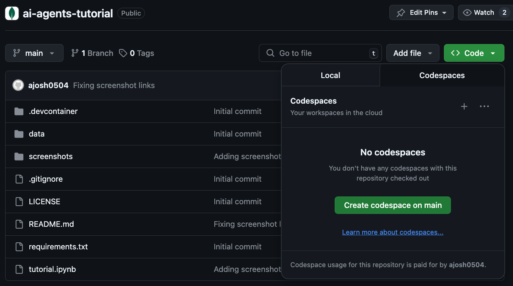
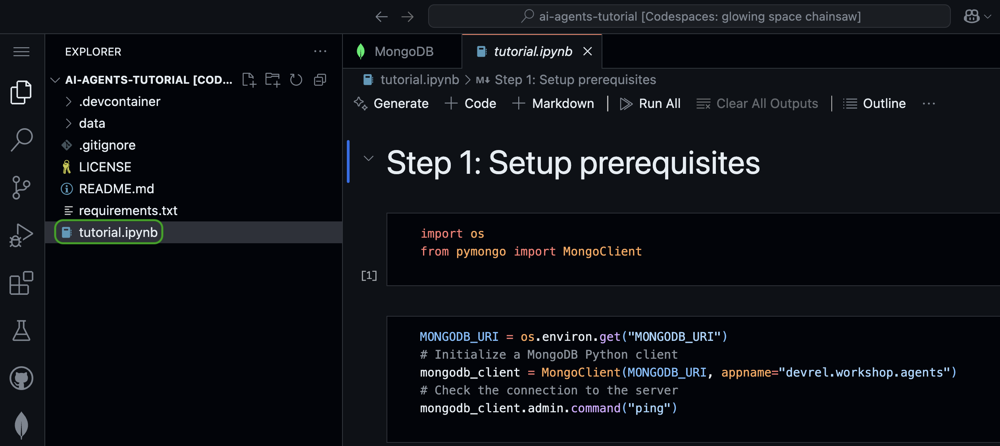
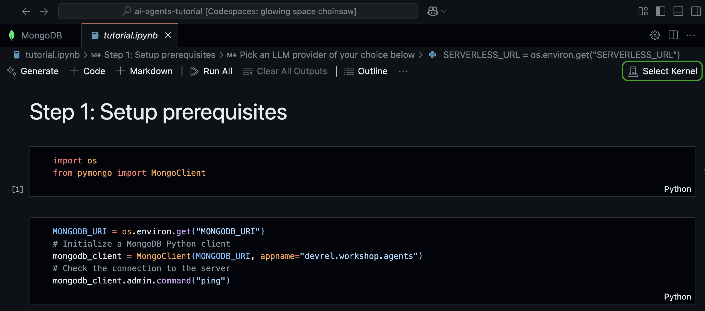
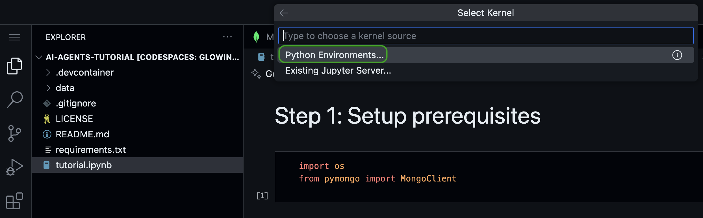
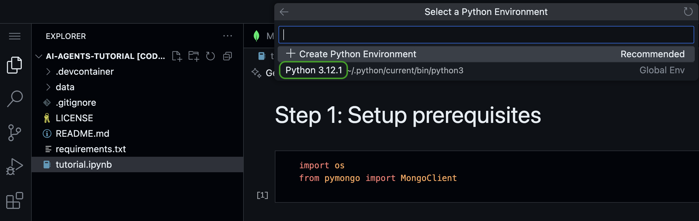

This repository contains everything needed to run a self-contained AI agents tutorial built using MongoDB, Gemini and LangGraph.

Slides accompanying this tutorial can be found [here](https://docs.google.com/presentation/d/e/2PACX-1vSFNtJI9CixQb-AEfJ_VQj7LiPSVH3iYajDu-CnHqPfi-spMf9Ls3d2E4ZlHM9VqtKVhtLpGRNg00co/).

**NOTE:** In this lab, we will be using Jupyter Notebooks, which is an interactive Python environment. If you are new to Jupyter Notebooks, use [this](https://mongodb-developer.github.io/vector-search-lab/docs/dev-env/jupyter-notebooks) guide to familiarize yourself with the environment.

# Running the tutorial

You will be working in a Jupyter Notebook in a GitHub Codespace throughout this lab. A codespace is a cloud-hosted, containerized development environment that comes pre-configured with all the tools you need to run this tutorial.

To create a codespace, click the Code button on the repo's home page. Under the Codespaces tab, click **Create a codespace on main**. You will be prompted to sign into GitHub if you haven't already.

Let it run for a few seconds as it prepares your environment. It will clone the repository, prepare the container, and run the installation scripts. Once the environment is built, you should see a list of files appear under the Explorer. 

In the left navigation bar of the IDE, click on the file named `tutorial.ipynb` to open the Jupyter Notebook for this tutorial.

Next, select the Python interpreter by clicking **Select Kernel** at the top right of the IDE.

In the modal that appears, click **Python environments...** and select the interpreter that is marked as **Recommended** or **Global Env**.

That's it! You're ready for the lab!
